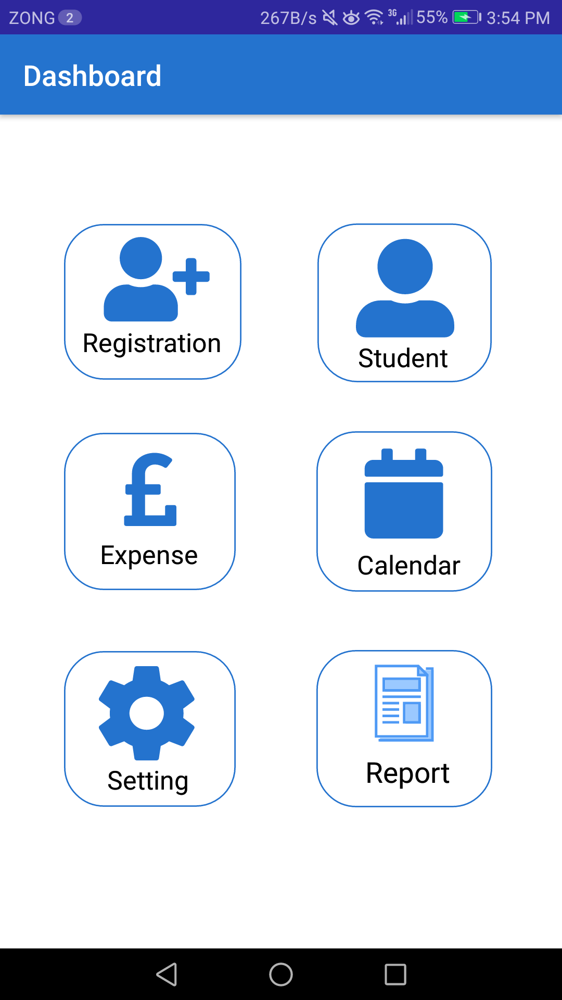

# Student Driving Managment System
 
<h1>About</h1>
An application that provides features to manage student information related to driving school based on their expenses, personal details, appointments etc. User can register new students, edit details of existing students, and add expenses related to fuels, vehicles or other. User can add appointments through calendar and view appointments later on.

##Screenshots

